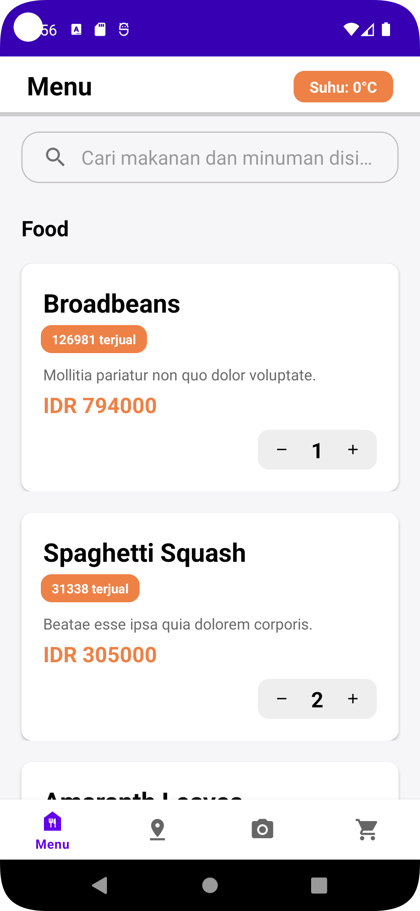
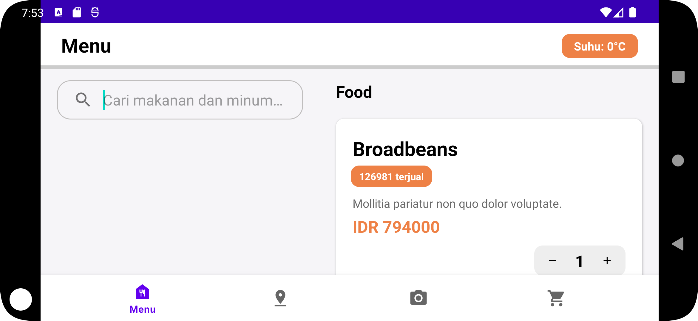
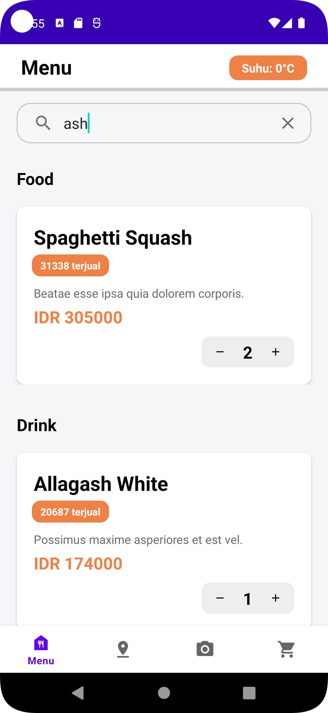
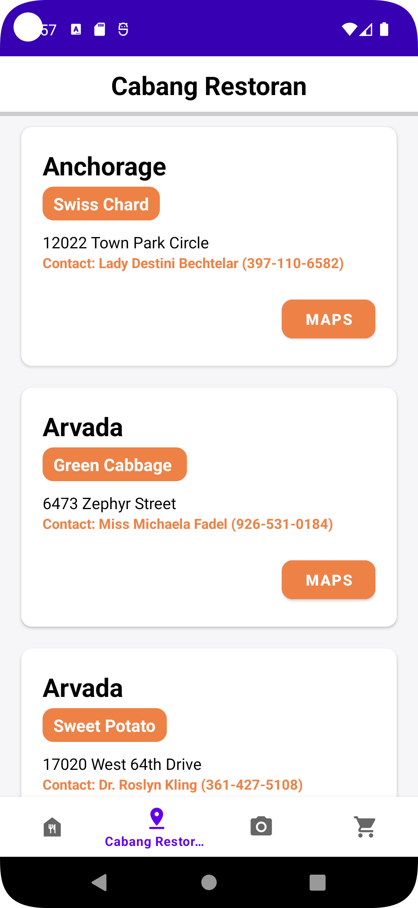
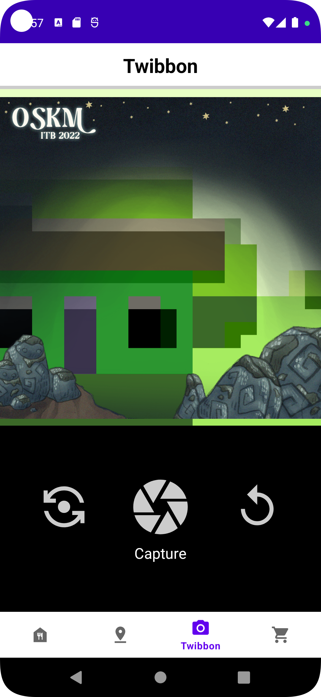
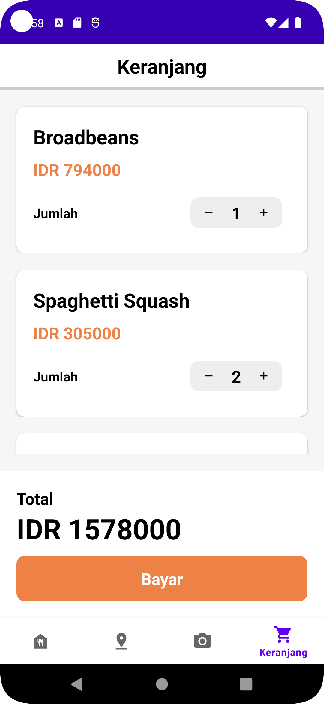
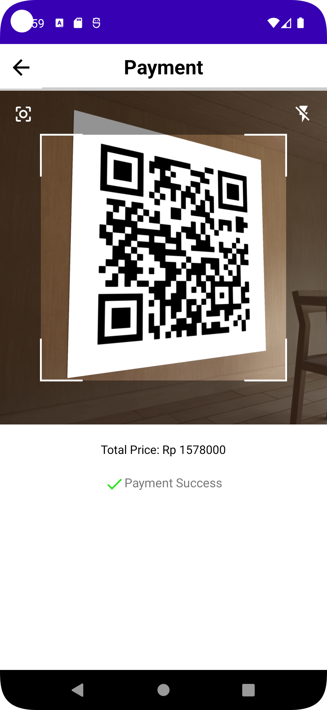

### IF3210-2023-Android-IOS
# Tugas Besar 1 - Android - PBD
> Oleh Kelompok IOS (IndomieOrakarikSosis)

## Deskripsi Aplikasi
Majika merupakan aplikasi pembelian makanan berbasis Android. Pada aplikasi ini, pengguna dapat melihat dan mencari daftar makanan dan minuman, cabang restoran, serta keranjang, melakukan pengambilan gambar dengan twibbon yang tersedia, dan melakukan pembayaran dengan cara memindai QR Code.

## Library yang Digunakan
* Code Scanner: untuk memindai QR Code
* Room: sebagai local SQLite database
* Retrofit: sebagai type-safe HTTP client
* Moshi: sebagai converter
* AndroidX

## Screenshots Tampilan Aplikasi
### Halaman Menu

### Halaman Cabang Restoran

### Halaman Twibbon

### Halaman Keranjang

### Halaman Pembayaran

## Pembagian Tugas Kelompok
* Fikri Khoiron Fadhila (135200056)
    * Membuat navigation bar, termasuk mekanisme navigasi antar-fragment halaman
    * Membuat header
    * Membuat mekanisme pemindaian suhu ruangan
    * Membuat halaman payment/pembayaran
    * Membuat mekanisme integrasi dengan data dari API backend
    * Melakukan review dan debug terhadap code

* Eiffel Aqila Amarendra (13520074)
    * Membuat halaman menu, termasuk search dan responsivitas
    * Membuat halaman keranjang
    * Membuat room dengan repository pattern
    * Membuat header
    * Membuat mekanisme integrasi dengan data dari API backend
    * Melakukan review dan debug terhadap code

* Jason Kanggara (13520080)
    * Membuat halaman twibbon
    * Membuat halaman cabang restoran, termasuk intent terhadap google map
    * Membuat mekanisme integrasi dengan data dari API backend
    * Melakukan review dan debug terhadap code

## Jumlah Jam Persiapan dan Pengerjaan
* Fikri Khoiron Fadhila: 12 jam
* Eiffel Aqila Amarendra: 12 jam
* Jason Kanggara: 12 jam

## Developer
Dibuat oleh:
- Fikri Khoiron Fadhila 135200056
- Eiffel Aqila Amarendra 13520074
- Jason Kanggara 13520080